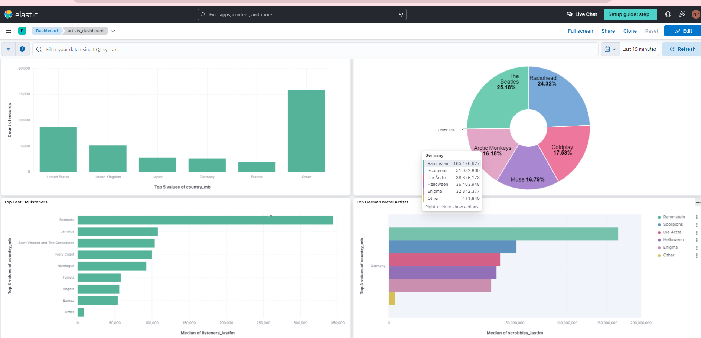

# Data Analytics Dashboard
This is to create the data analytics dashboard using elasticsearch, performing EDA thorugh pyspark, hadoop, hive and AWS glue ETL

## Getting started
Let me clearly define the yardsticks, for me not to deviate much;
- Create the data analystics project with either web or the mobile interface
- Big data, have to satisfy at least one V our of 5 Vs (Volume, velocity, veracity, value & variety)
- tech stack should have at least one of these mentioned tools
    - Map reduce, spark, storm, hive, pig, flink etc.

## Project status
Current status : web interface, using fastAPI (yet to be done)
for more info on the steps, please follow steps.pdf

## Tech stack 
1. Cloud service provider : AWS, GCP
    1. AWS for EMR, ETL operations
    2. GCP hosted elasticsearch cloud, final data visulisations 
2. Pre-processing : AWS Athena
3. Processing & ETL : pyspark, hive, glue
4. File system : S3, GCP bucket, HDFS
5. Data storage : hive for big data storage and elsticsearch index for final dashbaord
6. Visualisation : Kibana Elastic Cloud Dashboard
7. BE API : python

